# Electricity Monitoring App - Core Process Documentation

## Table of Contents
- [Application Overview](#application-overview)
- [System Architecture](#system-architecture)
- [Core Processes](#core-processes)
  - [1. Authentication Flow](#1-authentication-flow)
  - [2. Meter Reading Input](#2-meter-reading-input)
  - [3. Dashboard Analytics](#3-dashboard-analytics)
  - [4. Reading History Management](#4-reading-history-management)
  - [5. Settings Management](#5-settings-management)
  - [6. Token/Tariff Calculation](#6-tokentariff-calculation)
- [UI/UX Features](#uiux-features)
  - [7. Internationalization (i18n)](#7-internationalization-i18n)
  - [8. Premium UI Design System](#8-premium-ui-design-system)
- [Data Flow Overview](#data-flow-overview)

---

## Application Overview

The **Electricity Monitoring Web Application** is a personal web application for recording electricity meter readings (kWh) and providing real-time analytical insights such as usage per day, week, and month.

### Key Features
| Feature | Description |
|---------|-------------|
| **Manual Input** | Record meter readings with optional token information via tabbed interface |
| **Smart Top-Up** | Auto-calculate new meter position based on token purchase |
| **Cloud Storage** | Supabase PostgreSQL database for permanent data storage |
| **Authentication** | Email/Password and Google OAuth login |
| **Analytics Dashboard** | View daily, weekly, and monthly usage patterns with premium charts |
| **Cost Estimation** | Calculate costs based on tariff configurations with budget tracking |
| **Token Prediction** | Predict when your token will be depleted with remaining kWh display |
| **Multi-Language** | Full support for English and Indonesian (i18n) |
| **Premium UI** | Modern glassmorphism design with dark mode and smooth animations |
| **Responsive Layout** | Sidebar navigation with mobile-friendly design |

### Tech Stack


---

## System Architecture


---

## Core Processes

### 1. Authentication Flow

The authentication system uses Supabase Auth and supports multiple authentication methods with premium UI design.

#### Authentication Methods
- **Email/Password Registration** - With email confirmation
- **Email/Password Login** - Secure session management
- **Google OAuth** - One-click social login
- **Password Reset via Email** - Secure recovery flow

#### Flow Diagram


#### Key Files
| File | Responsibility |
|------|----------------|
| [AuthContext.js](file:///d:/Project/electricity-monitoring/frontend/src/contexts/AuthContext.js) | Authentication state management |
| [Login.jsx](file:///d:/Project/electricity-monitoring/frontend/src/pages/Login.jsx) | Login page with premium UI |
| [Register.jsx](file:///d:/Project/electricity-monitoring/frontend/src/pages/Register.jsx) | Registration with validation |
| [AuthCallback.jsx](file:///d:/Project/electricity-monitoring/frontend/src/pages/AuthCallback.jsx) | OAuth callback handler |
| [ProtectedRoute.jsx](file:///d:/Project/electricity-monitoring/frontend/src/components/ProtectedRoute.jsx) | Route protection component |
| [ForgotPassword.jsx](file:///d:/Project/electricity-monitoring/frontend/src/pages/ForgotPassword.jsx) | Password reset request |
| [ResetPassword.jsx](file:///d:/Project/electricity-monitoring/frontend/src/pages/ResetPassword.jsx) | New password form |

---

### 2. Meter Reading Input

The core functionality for recording electricity meter readings with **tabbed interface** separating "Record Reading" and "Top Up Token" modes.

#### Input Modes

```mermaid
flowchart LR
    subgraph TabInterface["Tabbed Input Interface"]
        ReadingTab["📊 Record Reading<br/>(Blue Theme)"]
        TopUpTab["⚡ Top Up Token<br/>(Yellow Theme)"]
    end
    
    ReadingTab --> RecordConsumption["Record meter decrease<br/>Validates consumption"]
    TopUpTab --> SmartTopUp["Smart Pre-fill<br/>Auto-calculates new reading"]
```



#### Record Reading Flow


#### Duplicate Date Handling


#### Date-Aware kWh Validation

When inputting a new reading, the system validates that the new kWh value is **lower** than the previous reading (electricity consumption decreases the meter). The validation compares by **date only** (ignoring time).

> [!IMPORTANT]
> The `getLastReadingBeforeDate()` function fetches the last reading **before the selected date** (ignoring time), not the absolute latest reading. This allows correct validation when inputting readings on dates where other readings already exist.

```mermaid
flowchart TD
    A[User selects date: Dec 29, 2PM] --> B[Extract date only: 2025-12-29]
    B --> C[Query: readings WHERE date < 2025-12-29]
    C --> D[Returns: Dec 28, 80 kWh]
    D --> E{Input 70 kWh valid?}
    E -->|70 < 80 ✓| F[Valid - Show consumption hint]
    E -->|70 >= 80 ✗| G[Error - Must use Top Up mode]
```



| Scenario | Input Date | Input kWh | Compares Against | Result |
|----------|-----------|-----------|------------------|--------|
| Valid reading | Dec 29 (any time) | 70 | Dec 28: 80 kWh | ✅ Valid |
| Invalid - increase | Dec 29 (any time) | 90 | Dec 28: 80 kWh | ❌ Error |

#### Data Structure


#### Key Files
| File | Responsibility |
|------|----------------|
| [InputForm.jsx](file:///d:/Project/electricity-monitoring/frontend/src/pages/InputForm.jsx) | Tabbed reading input form UI |
| [DuplicateDateModal.jsx](file:///d:/Project/electricity-monitoring/frontend/src/components/DuplicateDateModal.jsx) | Duplicate date conflict resolution |
| [ReadingAnomalyModal.jsx](file:///d:/Project/electricity-monitoring/frontend/src/components/ReadingAnomalyModal.jsx) | Reading validation warnings |
| [supabaseService.js](file:///d:/Project/electricity-monitoring/frontend/src/services/supabaseService.js) | `addReading()`, `updateReading()` functions |
| [settings.js](file:///d:/Project/electricity-monitoring/frontend/src/utils/settings.js) | `calculateTokenAmount()` function |
| [tariff.js](file:///d:/Project/electricity-monitoring/frontend/src/utils/tariff.js) | `estimateKwhFromTokenCost()` function |
| [validationService.js](file:///d:/Project/electricity-monitoring/frontend/src/utils/validationService.js) | Reading validation logic |

---

### 3. Dashboard Analytics

The dashboard provides comprehensive analytics with a **premium VoltaicMonitor layout** featuring glassmorphism cards and responsive charts.

#### Dashboard Layout


#### Flow Diagram


#### Chart Features


#### Key Files
| File | Responsibility |
|------|----------------|
| [Dashboard.jsx](file:///d:/Project/electricity-monitoring/frontend/src/pages/Dashboard.jsx) | Dashboard page orchestrator |
| [TotalUsageCard.jsx](file:///d:/Project/electricity-monitoring/frontend/src/components/dashboard/TotalUsageCard.jsx) | Usage bar chart with top-up markers |
| [EstCostCard.jsx](file:///d:/Project/electricity-monitoring/frontend/src/components/dashboard/EstCostCard.jsx) | Cost estimation with budget progress |
| [TokenPredictionCard.jsx](file:///d:/Project/electricity-monitoring/frontend/src/components/dashboard/TokenPredictionCard.jsx) | Token depletion prediction |
| [MainUsageChart.jsx](file:///d:/Project/electricity-monitoring/frontend/src/components/dashboard/MainUsageChart.jsx) | Consumption trends & balance charts |
| [GlobalFilterBar.jsx](file:///d:/Project/electricity-monitoring/frontend/src/components/dashboard/GlobalFilterBar.jsx) | Day/Week/Month toggle |
| [AlertBox.jsx](file:///d:/Project/electricity-monitoring/frontend/src/components/dashboard/AlertBox.jsx) | Usage warning alerts |
| [RecentReadingsList.jsx](file:///d:/Project/electricity-monitoring/frontend/src/components/dashboard/RecentReadingsList.jsx) | Recent readings display |
| [EfficiencyScoreCard.jsx](file:///d:/Project/electricity-monitoring/frontend/src/components/dashboard/EfficiencyScoreCard.jsx) | Gamified efficiency score display |
| [TokenBurnRateChart.jsx](file:///d:/Project/electricity-monitoring/frontend/src/components/dashboard/TokenBurnRateChart.jsx) | Token burn rate projection chart |
| [analytics.js](file:///d:/Project/electricity-monitoring/frontend/src/utils/analytics.js) | Analytics calculation functions |

#### Efficiency Score Card

The **EfficiencyScoreCard** provides a gamified scoring system (0-100) that analyzes user consumption patterns across three dimensions.


**Features:**
- **Consistency Score (40 pts)**: Measures how stable daily usage is (low variance = higher score)
- **Budget Score (30 pts)**: Tracks adherence to monthly budget settings
- **Trend Score (30 pts)**: Compares current week usage to previous week
- **Dynamic Tips**: Contextual improvement suggestions based on weak areas
- **Grade Display**: Letter grade (A+ to F) with colored visual indicator

> [!NOTE]
> Requires at least 7 days of data to calculate a meaningful score. Empty state shows "Need More Data" message.

#### Token Burn Rate Projection

The **TokenBurnRateChart** visualizes token depletion over time using an area chart with critical zones.


**Features:**
- **30-Day Rolling Average**: Uses historical data for accurate projection
- **60-Day Forecast**: Projects token balance up to 60 days ahead
- **Critical/Warning Reference Lines**: Visual thresholds at 3-day and 7-day marks
- **Depletion Date**: Shows exact predicted date when token reaches zero
- **Status Indicator**: Color-coded badge (Safe/Warning/Critical)
- **Daily Usage Stats**: Displays average consumption per day

---


### 4. Reading History Management

Complete CRUD operations with **premium WattMonitor layout** including advanced filtering and pagination.

#### History Page Layout

```mermaid
flowchart TB
    subgraph HistoryLayout["History Page Layout"]
        Sidebar["VoltaicSidebar"]
        
        subgraph MainContent["Main Content Area"]
            Header["Title: Reading History<br/>Subtitle: Past readings and consumption data"]
            
            subgraph Filters["Filter Bar"]
                Search["🔍 Search Input<br/>Search by date, value, notes"]
                DateFilter["📅 Date Range<br/>Last 30 Days / 12 Months / All"]
                TypeFilter["⚡ Type Filter<br/>All / Reading / Top Up"]
            end
            
            subgraph DataTable["Data Table"]
                Columns["Date | Type | Meter | Consumption | Cost | Proof | Actions"]
                Rows["Paginated Reading Rows"]
                StatusBadges["Type Badges: Reading (Blue) / Top Up (Yellow)"]
            end
            
            subgraph Pagination["Pagination Controls"]
                RowsPerPage["Rows per page: 10/25/50"]
                PageNav["Page Navigation: < 1 2 3 ... >"]
            end
        end
    end
    
    Sidebar --> MainContent
```



#### Flow Diagram


#### Edit Modal Mode-Locking

```mermaid
flowchart LR
    subgraph EditModalModes["EditReadingModal - Mode-Locked Editing"]
        ReadingEdit["Reading Mode Edit<br/>• Blue theme<br/>• Only reading fields<br/>• Validates consumption"]
        TopUpEdit["Top Up Mode Edit<br/>• Yellow theme<br/>• Token cost fields<br/>• Auto-calculate kWh"]
    end
    
    ReadingEntry["Reading Entry"] -->|Edit| ReadingEdit
    TopUpEntry["Top Up Entry"] -->|Edit| TopUpEdit
```



#### Key Files
| File | Responsibility |
|------|----------------|
| [History.jsx](file:///d:/Project/electricity-monitoring/frontend/src/pages/History.jsx) | Premium history page with filters |
| [EditReadingModal.jsx](file:///d:/Project/electricity-monitoring/frontend/src/components/EditReadingModal.jsx) | Mode-locked edit modal |
| [DeleteConfirmationModal.jsx](file:///d:/Project/electricity-monitoring/frontend/src/components/DeleteConfirmationModal.jsx) | Delete confirmation modal |
| [supabaseService.js](file:///d:/Project/electricity-monitoring/frontend/src/services/supabaseService.js) | CRUD operations |

---

### 5. Settings Management

User profile and tariff settings with **ElectroSaaS premium design** including budget configuration.

#### Settings Page Layout

```mermaid
flowchart TB
    subgraph SettingsLayout["Settings Page Layout"]
        Breadcrumb["Breadcrumb: Home > Settings & Tariff"]
        
        subgraph MainGrid["Two-Column Grid"]
            subgraph LeftColumn["Left Column"]
                ProfileCard["Profile Card<br/>• Avatar<br/>• Display Name (Editable)<br/>• Email (Read-only)<br/>• Role Badge"]
            end
            
            subgraph RightColumn["Right Column"]
                TariffSection["Tariff Configuration<br/>• PLN Official / Custom Toggle<br/>• Tariff Group Selector<br/>• Power Capacity<br/>• Effective Rate Display"]
                
                FeesSection["Base Rates & Fees<br/>• Admin Fee Input<br/>• Tax Percentage Input<br/>• Formula Display"]
                
                BudgetSection["Budget Configuration<br/>• Monthly Budget Input<br/>• Alert Threshold Slider<br/>• Daily/Weekly/Monthly Preview"]
            end
        end
        
        SaveButton["💾 Save Configuration Button"]
    end
```



#### Flow Diagram



```mermaid
flowchart TD
    Start([User Opens Settings]) --> LoadSettings
    
    subgraph LoadSettings["Load Settings - Hybrid Approach"]
        L1[Load Local Settings First - Instant]
        L2[Apply to State]
        L3{User Authenticated?}
        L4[Ensure User Profile Exists]
        L5[Load Cloud Settings from Supabase]
        L6[Merge Cloud → Local]
        L7[Apply Merged Settings]
        
        L1 --> L2 --> L3
        L3 -->|Yes| L4 --> L5 --> L6 --> L7
        L3 -->|No| DisplayForm
    end
    
    L7 --> DisplayForm
    L2 --> DisplayForm
    
    subgraph DisplayForm["Display Settings Form"]
        F1[Profile Section]
        F2[Display Name Input]
        F3[Email Display - Read Only]
        F4[Tariff Configuration Section]
        F5[PLN / Custom Tab Toggle]
        F6{Mode?}
        F7[PLN: Group + Capacity Selectors]
        F8[Custom: Name + Rate Inputs]
        F9[Additional Fees Section]
        F10[Admin Fee Input]
        F11[Tax Percentage Input]
        F12[Budget Configuration Section]
        F13[Monthly Budget Input]
        F14[Alert Threshold Slider]
        F15[Budget Preview Cards]
        
        F1 --> F2 --> F3 --> F4 --> F5 --> F6
        F6 -->|PLN| F7
        F6 -->|Custom| F8
        F7 --> F9
        F8 --> F9
        F9 --> F10 --> F11 --> F12 --> F13 --> F14 --> F15
    end
    
    DisplayForm --> UserAction{User Action}
    
    UserAction -->|Modify| UpdateState[Update Form State]
    UserAction -->|Save| SaveFlow
    UserAction -->|Reset| ResetFlow
    UserAction -->|Update Profile| ProfileFlow
    
    UpdateState --> UserAction
    
    subgraph SaveFlow["Save Settings Flow"]
        S1[Validate Inputs]
        S2{All Valid?}
        S3[Show Validation Errors]
        S4[Ensure User Profile]
        S5[Update Profile - Display Name]
        S6[Create Settings Object]
        S7[Save to LocalStorage]
        S8[Sync to Cloud via Supabase]
        S9[Show Success Message]
        S10[Redirect to Dashboard]
        
        S1 --> S2
        S2 -->|No| S3
        S2 -->|Yes| S4 --> S5 --> S6 --> S7 --> S8 --> S9 --> S10
    end
    
    subgraph ProfileFlow["Profile Update"]
        PF1[Click Edit Name]
        PF2[Enter New Display Name]
        PF3[Call updateUserProfile]
        PF4[Show Success Toast]
        
        PF1 --> PF2 --> PF3 --> PF4
    end
```

#### Budget Configuration


#### Key Files
| File | Responsibility |
|------|----------------|
| [Settings.jsx](file:///d:/Project/electricity-monitoring/frontend/src/pages/Settings.jsx) | Premium settings page |
| [settings.js](file:///d:/Project/electricity-monitoring/frontend/src/utils/settings.js) | Settings utility functions |
| [supabaseService.js](file:///d:/Project/electricity-monitoring/frontend/src/services/supabaseService.js) | Cloud settings sync |

---

### 6. Token/Tariff Calculation

Tiered tariff system for calculating kWh from token cost with support for PLN official rates.

#### Flow Diagram


#### PLN Tariff Groups

```mermaid
graph TB
    subgraph TariffGroups["PLN Tariff Categories"]
        R1["R1 - Residential<br/>Low Power"]
        R1M["R1M - Non-subsidized<br/>Residential"]
        R2["R2 - Residential<br/>Medium Power"]
        R3["R3 - Residential<br/>High Power"]
        B1["B1 - Small Business"]
        B2["B2 - Medium Business"]
        P1["P1 - Government"]
    end
    
    subgraph R1Sub["R1 Power Options"]
        R1_450["450 VA - Rp 415/kWh ⭐"]
        R1_900["900 VA - Rp 1,352/kWh ⭐"]
        R1_1300["1300 VA - Rp 1,444.70/kWh"]
        R1_2200["2200 VA - Rp 1,444.70/kWh"]
    end
    
    R1 --> R1Sub
    
    Note["⭐ = Subsidized Tariff"]
```

#### Key Files
| File | Responsibility |
|------|----------------|
| [settings.js](file:///d:/Project/electricity-monitoring/frontend/src/utils/settings.js) | `calculateTokenAmount()` entry point |
| [tariff.js](file:///d:/Project/electricity-monitoring/frontend/src/utils/tariff.js) | `estimateKwhFromTokenCost()` function |
| [tariffService.js](file:///d:/Project/electricity-monitoring/frontend/src/services/tariffService.js) | Supabase tariff operations |

---

## UI/UX Features

### 7. Internationalization (i18n)

Full multi-language support for English and Indonesian using i18next.

#### i18n Architecture

```mermaid
flowchart TB
    subgraph i18nSetup["i18n Configuration"]
        Config["i18n/index.js<br/>Initialize i18next"]
        Detector["Language Detector<br/>localStorage / Browser"]
    end
    
    subgraph TranslationFiles["Translation Files"]
        subgraph CoreTranslations["Core App Translations"]
            EN["i18n/en.json"]
            ID["i18n/id.json"]
        end
        
        subgraph PublicTranslations["Public Pages"]
            EnPublic["locales/en/public.json"]
            IdPublic["locales/id/public.json"]
        end
    end
    
    subgraph Components["Using Translations"]
        Hook["useTranslation() Hook"]
        Switcher["LanguageSwitcher Component"]
    end
    
    Config --> TranslationFiles
    Detector --> Config
    TranslationFiles --> Components
```

#### Translation Namespaces

| Namespace | Location | Usage |
|-----------|----------|-------|
| Default | `i18n/en.json`, `i18n/id.json` | All authenticated pages |
| Public | `locales/en/public.json`, `locales/id/public.json` | Landing page, auth pages |

#### Translation Categories

```mermaid
mindmap
    root((Translation Keys))
        common
            save, cancel, delete
            edit, loading, error
        nav
            home, dashboard
            inputReading, history
            settings
        dashboard
            title, subtitle
            totalUsage, costEstimation
            tokenPrediction
        input
            tabRecordReading
            tabTopUp
            validation messages
        history
            title, columns
            filters, actions
        settings
            tariffConfiguration
            budgetConfig
            validation
        auth
            signIn, register
            forgotPassword
            validation
        validation
            readingIncreasedError
            mustUseTopUp
            switchToTopUp
```

#### Key Files
| File | Responsibility |
|------|----------------|
| [i18n/index.js](file:///d:/Project/electricity-monitoring/frontend/src/i18n/index.js) | i18n initialization |
| [i18n/en.json](file:///d:/Project/electricity-monitoring/frontend/src/i18n/en.json) | English translations |
| [i18n/id.json](file:///d:/Project/electricity-monitoring/frontend/src/i18n/id.json) | Indonesian translations |
| [LanguageSwitcher.jsx](file:///d:/Project/electricity-monitoring/frontend/src/components/LanguageSwitcher.jsx) | Language toggle component |
| [localeFormatter.js](file:///d:/Project/electricity-monitoring/frontend/src/utils/localeFormatter.js) | Locale-aware formatting |

---

### 8. Premium UI Design System

Modern glassmorphism design with consistent theming across all pages.

#### Design Components

```mermaid
flowchart TB
    subgraph DesignSystem["Premium Design System"]
        subgraph Colors["Color Palette"]
            Primary["Primary: Indigo/Blue<br/>#4F46E5"]
            Secondary["Secondary: Emerald<br/>#10B981"]
            Accent["Accent: Yellow<br/>#F59E0B"]
            Dark["Dark Mode: Slate<br/>#1E293B"]
        end
        
        subgraph Effects["Visual Effects"]
            Glass["Glassmorphism<br/>backdrop-blur + opacity"]
            Gradients["Subtle Gradients<br/>background transitions"]
            Shadows["Layered Shadows<br/>depth perception"]
            Micro["Micro-animations<br/>hover/focus states"]
        end
        
        subgraph Layout["Layout Components"]
            Sidebar["VoltaicSidebar<br/>Collapsible navigation"]
            Cards["Stat Cards<br/>Glassmorphic containers"]
            Tables["Premium Tables<br/>Striped + hover"]
            Modals["Modal Dialogs<br/>Centered + animated"]
        end
    end
```

#### Component Themes

| Component | Theme | Color |
|-----------|-------|-------|
| Record Reading | Blue | `#3B82F6` |
| Top Up Token | Yellow/Amber | `#F59E0B` |
| Reading Badge | Blue | `bg-blue-100` |
| Top Up Badge | Yellow | `bg-yellow-100` |
| Success State | Green | `#10B981` |
| Error State | Red | `#EF4444` |
| Warning State | Amber | `#F59E0B` |

#### Key Files
| File | Responsibility |
|------|----------------|
| [VoltaicSidebar.jsx](file:///d:/Project/electricity-monitoring/frontend/src/components/VoltaicSidebar.jsx) | Premium sidebar navigation |
| [Layout.jsx](file:///d:/Project/electricity-monitoring/frontend/src/components/Layout.jsx) | Page layout wrapper |
| [StatCard.jsx](file:///d:/Project/electricity-monitoring/frontend/src/components/StatCard.jsx) | Glassmorphic stat cards |
| [index.css](file:///d:/Project/electricity-monitoring/frontend/src/index.css) | Global styles |

---

## Data Flow Overview

### Complete Application Data Flow

```mermaid
flowchart TB
    subgraph UserActions["User Actions"]
        Login[Login/Register]
        Input[Input Reading]
        ViewDash[View Dashboard]
        ViewHist[View History]
        Config[Configure Settings]
        SwitchLang[Switch Language]
    end
    
    subgraph Frontend["Frontend Processing"]
        AuthContext[AuthContext]
        Forms[Form Components]
        Analytics[Analytics Utils]
        Charts[Chart Components]
        SettingsUtil[Settings Utils]
        i18nContext[i18n Context]
    end
    
    subgraph Services["Service Layer"]
        SupabaseService[supabaseService.js]
        TariffService[tariffService.js]
    end
    
    subgraph Supabase["Supabase Backend"]
        Auth[Supabase Auth]
        DB[(PostgreSQL)]
        Storage[Supabase Storage]
        RPC[RPC Functions]
    end
    
    Login --> AuthContext
    AuthContext --> Auth
    Auth --> DB
    
    Input --> Forms
    Forms --> SettingsUtil
    SettingsUtil --> TariffService
    TariffService --> RPC
    Forms --> SupabaseService
    SupabaseService --> DB
    SupabaseService --> Storage
    
    ViewDash --> SupabaseService
    SupabaseService --> Analytics
    Analytics --> Charts
    
    ViewHist --> SupabaseService
    SupabaseService --> DB
    
    Config --> SettingsUtil
    SettingsUtil --> SupabaseService
    SupabaseService --> DB
    
    SwitchLang --> i18nContext
    i18nContext --> LocalStorage[(LocalStorage)]
```

### State Management Flow

```mermaid
stateDiagram-v2
    [*] --> Unauthenticated
    
    Unauthenticated --> Authenticating: Login/Register
    Authenticating --> Authenticated: Success
    Authenticating --> Unauthenticated: Failure
    
    Authenticated --> Dashboard: Load Data
    Dashboard --> InputForm: Add Reading
    Dashboard --> History: View History
    Dashboard --> Settings: Configure
    
    InputForm --> ReadingMode: Select Record Reading
    InputForm --> TopUpMode: Select Top Up
    ReadingMode --> Dashboard: Save Success
    TopUpMode --> Dashboard: Save Success
    
    History --> EditModal: Edit Reading
    EditModal --> History: Save/Cancel
    History --> Dashboard: Navigate
    
    Settings --> Dashboard: Save Success
    
    Authenticated --> Unauthenticated: Logout
```

---

## Summary

This documentation covers the core processes and features of the Electricity Monitoring application:

| # | Process | Key Function |
|---|---------|--------------|
| 1 | **Authentication** | User management with email/OAuth support and premium UI |
| 2 | **Meter Reading Input** | Tabbed interface with Record Reading and Smart Top-Up modes |
| 3 | **Dashboard Analytics** | VoltaicMonitor layout with glassmorphic cards and responsive charts |
| 4 | **History Management** | Premium table with filters, pagination, and mode-locked editing |
| 5 | **Settings Management** | ElectroSaaS design with PLN tariffs and budget configuration |
| 6 | **Token Calculation** | Tiered tariff system for accurate kWh estimation |
| 7 | **Internationalization** | Full English and Indonesian language support |
| 8 | **Premium UI Design** | Modern glassmorphism with consistent theming |

### Integration Points

All processes are integrated through:
- **Supabase** for backend services (Auth, Database, Storage)
- **React Context** for state management (Auth, i18n)
- **Service layer** for API abstraction
- **Utility functions** for calculations and formatting
- **i18next** for multi-language support
- **TailwindCSS + Custom CSS** for premium styling
- **Recharts** for data visualization

### Recent Updates Summary

| Feature | Description |
|---------|-------------|
| **Efficiency Score** | Gamified scoring (0-100) analyzing consistency, budget adherence, and trends |
| **Token Burn Rate** | Visual projection chart showing token depletion with critical/warning zones |
| **Tabbed Input Form** | Separate modes for Recording and Top-Up with distinct themes |
| **Smart Pre-fill** | Auto-calculate new meter position based on token purchase |
| **Reading Validation** | Detect anomalies when reading increases without top-up |
| **Duplicate Date Handling** | Modal to edit existing or replace records |
| **Mode-Locked Editing** | Edit modals respect the original entry type |
| **Budget Configuration** | User-configurable monthly budget with alert thresholds |
| **Chart Improvements** | Top-up markers, weekly date ranges, chronological sorting |
| **Premium Redesign** | All pages upgraded to glassmorphism design |
| **Full i18n Support** | Complete translations for EN and ID languages |

